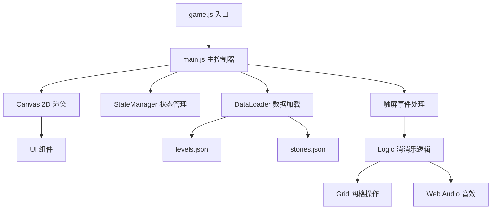

# WeChat_app_match-3-game

# 🍬 消消乐之旅 — 微信小游戏

<p align="center">
  
  
  
  
</p>

一款以**广东八大城市**为主题的 Match-3 消消乐微信小游戏。玩家通过消除玩法依次解锁深圳、东莞、珠海、中山、江门、佛山、广州等城市，收集当地美食，角逐好友排行榜。

---

## 🎮 游戏截图

> *（上传到 GitHub 后可在 Issues 中贴图，或创建 `screenshots/` 目录存放截图）*

| 主菜单 | 关卡地图 | 游戏中 | 排行榜 |
|:---:|:---:|:---:|:---:|
|  |  |  |  |

---

## ✨ 功能特性

### 🧩 核心玩法
- **经典 Match-3 消除** — 点击相邻方块交换位置，三个或以上相同元素连成一线即可消除
- **8 个关卡** — 教程关 + 广东 7 城（深圳 → 东莞 → 珠海 → 中山 → 江门 → 佛山 → 广州）
- **连击系统** — 消除后掉落新方块自动触发连续消除，连击越高分数加成越大
- **步数限制** — 每关有限定步数，策略性规划每一步
- **星级评价** — 根据得分评定 1~3 星（得分 ≥ 目标分 2 倍 = 3 星）

### 👤 用户系统
- **微信授权登录** — 一键微信登录
- **账号密码登录/注册** — 自定义账号体系
- **游客模式** — 无需注册即刻体验（数据不保存）
- **数据持久化** — 登录用户进度自动保存到微信 Storage

### 👫 好友 & 排行
- **好友搜索** — 通过用户名搜索并添加好友
- **好友申请** — 发送 / 接受 / 拒绝好友请求
- **好友排行榜** — 按总分排名，金/银/铜牌标识
- **微信好友同步** — 自动拉取已授权同款小游戏的微信好友

### 🛒 商城 & 收集
- **服装商城** — 用游戏金币购买装扮（休闲装、运动装、礼服、古装、魔法装、未来装）
- **美食图鉴** — 通关解锁城市后收集对应元素类型的当地美食
- **背景自定义** — 8 种主题色任意切换

### 🔊 音效
- 基于 Web Audio API 的实时音效合成（交换音效、消除音效、连击音效）

---

## 📁 项目结构

```
Wechat2/
├── data/
│   ├── levels.json              # 关卡配置（8关，难度递增）
│   └── stories.json             # 剧情对话数据
├── js/
│   ├── main.js                  # 🎯 主入口：状态机、用户交互、渲染调度
│   ├── logic.js                 # 🧠 消消乐核心逻辑：匹配检测、消除、下落、连击
│   ├── render.js                # 🎨 Canvas 2D 渲染引擎：所有界面的绘制
│   ├── grid.js                  # 📐 网格数据结构：方块布局与操作
│   ├── ui.js                    # 🔘 UI 组件：按钮管理与点击检测
│   ├── dataLoader.js            # 📦 数据加载：关卡 & 剧情 JSON 解析
│   └── stateManager.js          # 🔄 状态管理器：游戏状态切换
├── game.js                      # 微信小游戏入口
├── game.json                    # 小游戏配置（竖屏、显示状态栏）
├── project.config.json          # 微信开发者工具项目配置
└── README.md
```

---

## 🗺️ 关卡设计

| 关卡 | 城市 | 棋盘大小 | 步数 | 目标分 | 元素种类 |
|:---:|:---:|:---:|:---:|:---:|:---:|
| 1 | 📖 教程关 | 4×4 | 15 | 300 | 3 |
| 2 | 🏙️ 深圳 | 5×5 | 18 | 500 | 4 |
| 3 | 🏭 东莞 | 5×5 | 20 | 650 | 4 |
| 4 | 🌊 珠海 | 5×6 | 22 | 850 | 4 |
| 5 | 🏯 中山 | 6×6 | 25 | 1100 | 5 |
| 6 | 🌉 江门 | 6×6 | 28 | 1400 | 5 |
| 7 | 🗿 佛山 | 6×7 | 32 | 1800 | 5 |
| 8 | 🗼 广州 | 7×7 | 35 | 2200 | 6 |

> 棋盘逐步扩大，元素种类递增，难度曲线平滑。

---

## 🚀 快速开始

### 环境要求

- [微信开发者工具](https://developers.weixin.qq.com/miniprogram/dev/devtools/download.html)（最新版）
- 微信小游戏 AppID（在[微信公众平台](https://mp.weixin.qq.com/)注册）

### 本地运行

1. **克隆项目**
   ```bash
   git clone https://github.com/yourusername/Wechat2.git
   ```

2. **打开微信开发者工具**
   - 选择 **「小游戏」** 项目类型
   - 导入项目目录，填入你的 AppID（或使用测试号）
   - 点击「编译」即可在模拟器中运行

3. **真机预览**
   - 点击工具栏「预览」生成二维码
   - 微信扫码即可在手机上体验

### 修改关卡

编辑 `data/levels.json` 即可自定义关卡参数：
```json
{
  "id": 9,
  "name": "新关卡",
  "icon": "🎯",
  "rows": 8,
  "cols": 8,
  "maxSteps": 40,
  "targetScore": 3000,
  "elementTypes": 6
}
```

---

## 🏗️ 技术架构



**核心状态机**：`LOGIN → MENU → MAP → STORY → PLAYING → (CHOICE) → RESULT`

- 纯 Canvas 2D 渲染，无第三方依赖
- 触摸事件驱动，适配移动端交互
- 数据通过 `wx.setStorageSync` / `wx.getStorageSync` 持久化
- 连击链式消除 + 掉落填充 + 自动检测循环

---

## 🤝 贡献

欢迎提交 Issue 和 Pull Request！

1. Fork 本项目
2. 创建功能分支 (`git checkout -b feature/amazing-feature`)
3. 提交更改 (`git commit -m 'Add some amazing feature'`)
4. 推送到分支 (`git push origin feature/amazing-feature`)
5. 提交 Pull Request

---

## 📄 License

MIT © 2026

---

## 📮 联系

如有问题或建议，欢迎提交 [GitHub Issues](https://github.com/yourusername/Wechat2/issues)。
